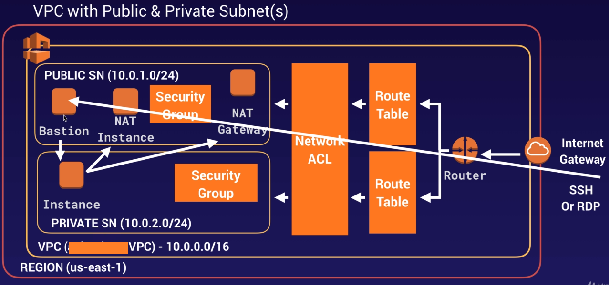

## Capstone Microservices Project(Cloud Developer) NanoDegree 

### Overview : The purpose of the cloud developer capstone project is to give you a chance to combine what you've learned throughout the program. This project will be an important part of your portfolio that will help you achieve your Cloud-related career goals.

### PROJECT PROPOSAL(SCOPE): Capstone Project is a cloud application developed for Udacity Cloud Engineering Nanodegree. It allows users to register and log into a web client, post photos to the feed, and process photos using an image filtering microservice. I will be using the AWS for deploying the microservices project. Will be using IAM, S3, RDS-Postgres, VPC, Subnets, Internet Gatway(IGW), EC2, ELB, Dockers,Kubectl using KOPS to deploy the microservices on AWS Cloud.

The project is split into four services:
1. [The Ionic Client](./frontend/)- Ionic client web application which consumes the RestAPI Backend.
2. [RESTful API Service](./restapi-feed/), a Node-Express server which does user authentication and registration.
3. [RESTful API Service](./restapi-feed/), a Node-Express server which is used to list feeds and upload feed images to an AWS S3 bucket.
4. [RESTful API Service](./image-filter/), a Node-Express server which runs a simple script to process images.

Here goes the AWS deployment diagram and will be replicating the same for the project deployment. 


## PROJECT AWS ENVIRONMENT SETUP FOR DEPLOYMENT 
* STEP-01 : Create the VPC - CapstoneVPC (10.0.0.0/16). Create the three subnets:
  * Capstone_publicsubnet01 (10.0.1.0/24); Availability Zone: us-east-1a 
  * Capstone_privatesubnet02 (10.0.2.0/24); Availability Zone: us-east-1b
  * Capstone_publicsubnet03 (10.0.3.0/24); Availability Zone: us-east-1c
* STEP-02 : Create the Internet Gateway (IGW) : CapstoneIGW.  Attach the VPC (CapstoneVPC) to the CapstoneIGW.
* STEP-03 : Create the route table - Capstone_mypublicroute and associate it with the CapstoneVPC. Every subnet we create is by default 
  associated with the main route table. Edit routes in the custom route table to add the route to internet via CapstoneIGW. After this 
  edit the "subnet associations" and add the public subnets to it.
* STEP-04 : Create the RDS-Postgress-"capstonerds" database in the Capstone_privatesubnet02. 
* STEP-05 : Create the S3 Bucket(FILESTORES) in the Capstone_publicsubnet01.
  * File stores allow for archiving data. In AWS, the file store is called S3, and the archive resource is called “glacier”.
  * Content Delivery Network (CDN): are a network of proxy servers that are placed closer to end users to deliver data and compute. CDNs 
    reduce latency for end users.
  * SignedURLs allow clients to send and receive data by directly communicating with the file store. This saves the server from using 
    its bandwidth to serve as the intermediary that transmits data to and from the client. This is faster for clients as well.
  * Buckets: a simple directory-like system in which to store data
  * Bucket CORS Policy : You'll need this policy to create a bucket where we can use the SignedURL pattern.<?xml version="1.0" 
    encoding="UTF-8"?>
    ```
    <CORSConfiguration xmlns="http://s3.amazonaws.com/doc/2006-03-01/">
    <CORSRule>
       <AllowedOrigin>*</AllowedOrigin>
       <AllowedMethod>POST</AllowedMethod>
       <AllowedMethod>GET</AllowedMethod>
       <AllowedMethod>PUT</AllowedMethod>
       <AllowedMethod>DELETE</AllowedMethod>
       <AllowedMethod>HEAD</AllowedMethod>
       <AllowedHeader>*</AllowedHeader>
    </CORSRule>
    </CORSConfiguration>
    ```
### Deploying a Kubernetes Cluster with KOPS 
Kops (Kubernetes Operations), it’s an open-source free tool which helps us to easily deploy and manage a HA (High Availability) Kubernetes cluster on different cloud providers.
* Step1 : Create the AWS EC2 Instance and set the development environemnt.
* Step2 : Configure AWS CLI. And configure AWS account by using command "AWS Configure".
 ```
 curl https://s3.amazonaws.com/aws-cli/awscli-bundle.zip -o awscli-bundle.zip
 apt install unzip python
 unzip awscli-bundle.zip
 #sudo apt-get install unzip - if you dont have unzip in your system
 ./awscli-bundle/install -i /usr/local/aws -b /usr/local/bin/aws
 ```
* Step3 : Install kops and kubectl. kopsis the tool we need to create the Kubernetes cluster on AWS. kubectl is the cli we use to manage 
          the cluster once it’s up and running. 
          ##### Install Kops on Linux
  ```
          curl -Lo kops https://github.com/kubernetes/kops/releases/download/$(curl -s https://api.github.com/repos/kubernetes/kops/releases/latest | grep tag_name | cut -d '"' -f 4)/kops-linux-amd64
          chmod +x ./kops
          sudo mv ./kops /usr/local/bin/
  ```
          ##### Install Kubeclt on Linux
  ```
          curl -Lo kubectl https://storage.googleapis.com/kubernetes-release/release/$(curl -s https://storage.googleapis.com/kubernetes-release/release/stable.txt)/bin/linux/amd64/kubectl
         chmod +x ./kubectl
         sudo mv ./kubectl /usr/local/bin/kubectl 
  ```
* Step4 : Create an IAM user/role with Route53, EC2, IAM and S3 full access.
* Step5 : Create a Route53 private hosted zone (you can create Public hosted zone if you have a domain)
          Real domain in Route53 : It is now possible to use kops without a real domain. Instead of using a Route53 domain, we can 
          create a cluster using a subdomain of k8s.local, like chat.k8s.local. A cluster will be created with a load-balancer pointing 
          to our masters. Kops needs a real domain and valid zone setup into AWS Route53. I know, this can be a blocking step, 
          especially if you just want to just try kops on AWS. Unfortunately it doesn’t seem to be a way to around this. I’ve personally 
          changed my "amit-goswami.com" domain nameservers to Route53 time ago. It was super easy. I just had to download the zone file 
          from GoDaddy and import it into Route53, telling GoDaddy to use the Route53 nameservers.
  
  ##### Importing my personal registered domain name "amit-goswami.com" a Zone File from GODADDY.com and cofiguring ROUTE53:
          * https://docs.aws.amazon.com/Route53/latest/DeveloperGuide/resource-record-sets-creating-import.html

* Step6 : Create an S3 bucket : S3 bucket to store the cluster state: We just need to create an S3 bucket which kops will use to save 
           the cluster’s state files. I’ve called my bucket like a subdomain, state.app.amit-goswami.com
* Step7 : Creating the Kubernetes cluster using KOPS (Create kubernetes cluster definitions on S3 bucket)
          * Existing VPC and Internet Gateway will be re-used : Use kops create cluster with the --subnets argument for your existing 
            subnets:
          * Create ssh key to login into servers. #ssh-keygen -f .ssh/id_rsa
          
          ```
           export KOPS_STATE_STORE=s3://state.app.amit-goswami.com
           export CLUSTER_NAME=capstone.amit-goswami.com
           export VPC_ID=vpc-01a5884a775b4a474 # replace with your VPC id
           export NETWORK_CIDR=10.0.0.0/16 # replace with the cidr for the VPC ${VPC_ID}
           export SUBNET_ID=subnet-0b683542993fc8e8a # replace with your subnet id
           export SUBNET_CIDR=10.0.1.0/24 # replace with your subnet CIDR
           export SUBNET_IDS=subnet-0c6468c90331aa4dd,subnet-0b683542993fc8e8a # replace with your comma separated subnet ids

           kops create cluster --zones=us-east-1a,us-east-1c --name=${CLUSTER_NAME} --vpc=${VPC_ID} --subnets=${SUBNET_IDS} --master-count 3 --master-size=m3.medium --node-count 2 --node-size=t2.medium --ssh-public-key=~/.ssh/id_rsa.pub --dns-zone=amit-goswami.com --dns private --yes
          
          ```
 * Step8 : Create kubernetes cluser : kops update cluster capstone.amit-goswami.com --yes 
 * Step9 : Validate the cluster : kops validate cluster --state "s3://state.app.amit-goswami.com" --name capstone.amit-goswami.com       
 * Step10 : To list nodes : kubectl get nodes
 * Step11 : Kubernetes API and Security Group. The Kubernetes API is by default exposed on the internet. At the end it’s the only way we 
   can easily connect to our cluster (without using VPN connections to our VPC). 

## DEPLOYING THE CAPSTONE PROJECT MICROSERVICES TO THE KUBERNETES CLUSTER CREATED USING KOPS & KUBECTL
## Dockerhub Images
- [The Ionic Client](https://hub.docker.com/repository/docker/amitgoswami1027/capstone-frontend)
- [The Feed RESTful API](https://hub.docker.com/repository/docker/amitgoswami1027/capstone-restapi-feedv2)
- [The User RESTful API](https://hub.docker.com/repository/docker/amitgoswami1027/capstone-restapi-userv2)
- [The Image Filtering RESTful API](https://hub.docker.com/repository/docker/amitgoswami1027/capstone-restapi-image)
- [The Nginx Reverse Proxy](https://hub.docker.com/repository/docker/amitgoswami1027/capstone-reverseproxyv2)

## Starting the services as Docker
- Since the `docker-compose` file uses environment variables, therefore you need to tell the system to use the environment variables from your `~/.profile` file using the command source `~/.profile`.

- Navigate to [deployment/docker folder](./deployment/docker/) and build the images for each of our defined services, using the following command::

```shell
docker-compose -f docker-compose-build.yaml build --parallel
```
- To start the system, run a container for each of our defined services, in the de-attached mode:
```shell
docker-compose -f docker-compose up -d
```
- To see the list of running containers, run the command - `docker-compose ps`. You will see a list of container names, states, and ports listed.

- If you wish to stop the containers gracefully, use the below command:

```shell
docker-compose stop
# To remove (and stop) the container
docker-compose down
```

## Starting the app as a Kubernetes cluster locally
- To create K8s ***configMap***, ***secrets***, ***deployments*** and ***services*** use the below command:

```shell
kubectl apply -f udacity-c3-deployment/k8s --recursive
```
- Use Kubernetes port forwarding to see the application running, using the following command:

```shell
kubectl port-forward <reverseproxy-pod> 8080:8080
kubectl port-forward <frontend-pod> 8100:80
```

## Links

- [REST API server](http://a554ce0af3ab24996a6de96e85ab5130-409319829.us-east-1.elb.amazonaws.com:8080/api/v0).
- [Ionic client](http://a554ce0af3ab24996a6de96e85ab5130-409319829.us-east-1.elb.amazonaws.com:8100).

***Note***: You can find screenshots for the deployment (./screenshots/).

CONTAINERS: Abstraction of an application and its dependencies 
KUBERNETES PODS: Abstraction of multiple containers
KUBERNETES SERVICES: Abstraction of pods and their interfaces

#### Links:
* https://www.simform.com/use-nodejs-with-react/
* Rubic Guidelines : https://review.udacity.com/#!/rubrics/2578/view

### Deployment Configuration Files
* kubectl apply -f backend-feed-deployment.yaml 
* kubectl apply -f backend-user-deployment.yaml 
* kubectl apply -f frontend-deployment.yaml 
* kubectl apply -f reverseproxy-deployment.yaml
* kubectl apply -f pod-example/pod.yaml
* kubectl get pod -o wide

* Labels : Labels are "tags" in the form of key/value pairs that are associated with Kubernetes objects (Deployments/Pods). Multiple 
  objects may belong to a single Label. Labeling helps to identify all the objects (and resources) associated with a particular Label   
  value (say "Production" or "Testing"). Applying a Label does not have any impact on the behavior of the underlying object. They are 
  helpful in better organizing the objects (and resources).


## Getting Setup
 Frontend is designed to work with the RestAPI backends). It is recommended you stand up the backend first, test using Postman, and then the frontend should integrate.

### Installing Node and NPM
This project depends on Nodejs and Node Package Manager (NPM). Before continuing, you must download and install Node (NPM is included) from [https://nodejs.com/en/download](https://nodejs.org/en/download/).

### Installing Ionic Cli
The Ionic Command Line Interface is required to serve and build the frontend. Instructions for installing the CLI can be found in the [Ionic Framework Docs](https://ionicframework.com/docs/installation/cli).

### Installing project dependencies
This project uses NPM to manage software dependencies. NPM Relies on the package.json file located in the root of this repository. After cloning, open your terminal and run:
```bash
npm install
```
>_tip_: **npm i** is shorthand for **npm install**

### Setup Backend Node Environment
You'll need to create a new node server. Open a new terminal within the project directory and run:
1. Initialize a new project: `npm init`
2. Install express: `npm i express --save`
3. Install typescript dependencies: `npm i ts-node-dev tslint typescript  @types/bluebird @types/express @types/node --save-dev`
4. Look at the `package.json` file from the RestAPI repo and copy the `scripts` block into the auto-generated `package.json` in this project. This will allow you to use shorthand commands like `npm run dev`

### Configure The Backend Endpoint
Ionic uses enviornment files located in `./src/enviornments/enviornment.*.ts` to load configuration variables at runtime. By default `environment.ts` is used for development and `enviornment.prod.ts` is used for produciton. The `apiHost` variable should be set to your server url either locally or in the cloud.

***
### Running the Development Server
Ionic CLI provides an easy to use development server to run and autoreload the frontend. This allows you to make quick changes and see them in real time in your browser. To run the development server, open terminal and run:

```bash
ionic serve
```
### Building the Static Frontend Files
Ionic CLI can build the frontend into static HTML/CSS/JavaScript files. These files can be uploaded to a host to be consumed by users on the web. Build artifacts are located in `./www`. To build from source, open terminal and run:
ionic build

## Technologies (Important Reads)
* Kubernetes Deployments: https://kubernetes.io/docs/concepts/workloads/controllers/deployment/
* AWS EKS : https://aws.amazon.com/eks/
* WHY USE EKS(IMP) : https://itnext.io/kubernetes-is-hard-why-eks-makes-it-easier-for-network-and-security-architects-ea6d8b2ca965
* SET UP AWS-IAM AUTH: https://docs.aws.amazon.com/eks/latest/userguide/install-aws-iam-authenticator.html
* K8s Introduction: https://kubernetes.io/docs/reference/kubectl/overview/
* K8s Cheatsheet: https://kubernetes.io/docs/reference/kubectl/cheatsheet/
## KUBERNETES LINKS
* KUBERNETES IS HARD:https://itnext.io/kubernetes-is-hard-why-eks-makes-it-easier-for-network-and-security-architects-ea6d8b2ca965
* [Deploying a Kubernetes Cluster with Amazon EKS](https://logz.io/blog/amazon-eks-cluster/).
* ttps://www.poeticoding.com/create-a-high-availability-kubernetes-cluster-on-aws-with-kops/
* https://eksworkshop.com/spot/cloudformation/kubeconfig/
#### DATABASE READS
* SQL INJECTIONS
* https://sequelize.org/master/manual/migrations.html#creating-first-seed
* https://sequelize.org/master/manual/migrations.html
* PASSWORD MISUSE : https://haveibeenpwned.com/
* JWT : https://jwt.io/
* https://www.digitalocean.com/community/tutorials/angular-authentication-auth0
